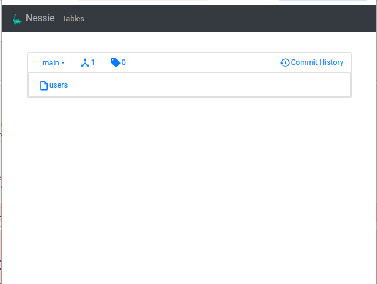

# Iceberg - Nessie - Hello World
> Lets make a small test to see it work

### Prerequisites to be able to run this here example
Working setup of podman or docker to start containers. (Here it is setup to use docker).
Get a local or other version of spark. Download it from here: (spark download)[https://spark.apache.org/downloads.html]. Untar the spark tar file and place it somewhere that make sense for you.  
Get a local version of nessie - we use a containerized version, that mean you need podman/docker to be able to start the container. Again this mean that we are not doing that much fancy stuff with the nessie setup, just running it out of the box. (Nessie)[https://projectnessie.org] webpage has tons of information one can investigate.  


### Run the show
```shell
uv run --with jupyter jupyter lab
```

or manually create the uv env - and activate it
```shell
uv sync

source .venv/bin/activate

jupyter jupyter lab
```

#### Nessie UI
|  |
|:---:|
| Figure 1 - Nessie UI - users table |